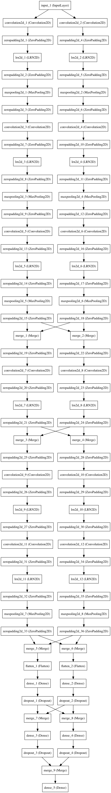

### Info

Two version of the AlexNet model have been created:

1.  Caffe Pre-trained version
2.  the version displayed in the diagram from the AlexNet paper

```
@article{ding2014theano,
  title={Theano-based Large-Scale Visual Recognition with Multiple GPUs},
  author={Ding, Weiguang and Wang, Ruoyan and Mao, Fei and Taylor, Graham},
  journal={arXiv preprint arXiv:1412.2302},
  year={2014}
}
```

### Keras Model Visulisation

**AlexNet (CaffeNet version )**


**AlexNet (Original)**



### Keras Model Builds

**AlexNet (CaffeNet version )**

    # Channel 1 - Convolution Net Layer 1
    x = conv2D_lrn2d(
        img_input, 3, 11, 11, subsample=(
            1, 1), border_mode='same')
    x = MaxPooling2D(
        strides=(
            4, 4), pool_size=(
                4, 4), dim_ordering=DIM_ORDERING)(x)
    x = ZeroPadding2D(padding=(1, 1), dim_ordering=DIM_ORDERING)(x)

    # Channel 1 - Convolution Net Layer 2
    x = conv2D_lrn2d(x, 48, 55, 55, subsample=(1, 1), border_mode='same')
    x = MaxPooling2D(
        strides=(
            2, 2), pool_size=(
                2, 2), dim_ordering=DIM_ORDERING)(x)
    x = ZeroPadding2D(padding=(1, 1), dim_ordering=DIM_ORDERING)(x)

    # Channel 1 - Convolution Net Layer 3
    x = conv2D_lrn2d(x, 128, 27, 27, subsample=(1, 1), border_mode='same')
    x = MaxPooling2D(
        strides=(
            2, 2), pool_size=(
                2, 2), dim_ordering=DIM_ORDERING)(x)
    x = ZeroPadding2D(padding=(1, 1), dim_ordering=DIM_ORDERING)(x)

    # Channel 1 - Convolution Net Layer 4
    x = conv2D_lrn2d(x, 192, 13, 13, subsample=(1, 1), border_mode='same')
    x = ZeroPadding2D(padding=(1, 1), dim_ordering=DIM_ORDERING)(x)

    # Channel 1 - Convolution Net Layer 5
    x = conv2D_lrn2d(x, 192, 13, 13, subsample=(1, 1), border_mode='same')
    x = ZeroPadding2D(padding=(1, 1), dim_ordering=DIM_ORDERING)(x)

    # Channel 1 - Cov Net Layer 6
    x = conv2D_lrn2d(x, 128, 27, 27, subsample=(1, 1), border_mode='same')
    x = MaxPooling2D(
        strides=(
            2, 2), pool_size=(
                2, 2), dim_ordering=DIM_ORDERING)(x)
    x = ZeroPadding2D(padding=(1, 1), dim_ordering=DIM_ORDERING)(x)

    # Channel 1 - Cov Net Layer 7
    x = Flatten()(x)
    x = Dense(2048, activation='relu')(x)
    x = Dropout(DROPOUT)(x)

    # Channel 1 - Cov Net Layer 8
    x = Dense(2048, activation='relu')(x)
    x = Dropout(DROPOUT)(x)

    # Final Channel - Cov Net 9
    x = Dense(output_dim=NB_CLASS,
              activation='softmax')(x)

**AlexNet (Original)**

    # Channel 1 - Conv Net Layer 1
    x = conv2D_bn(img_input, 3, 11, 11, subsample=(1, 1), border_mode='same')
    x = MaxPooling2D(
        strides=(
            4, 4), pool_size=(
                4, 4), dim_ordering=DIM_ORDERING)(x)
    x = ZeroPadding2D(padding=(1, 1), dim_ordering=DIM_ORDERING)(x)

    # Channel 2 - Conv Net Layer 1
    y = conv2D_bn(img_input, 3, 11, 11, subsample=(1, 1), border_mode='same')
    y = MaxPooling2D(
        strides=(
            4, 4), pool_size=(
                4, 4), dim_ordering=DIM_ORDERING)(y)
    y = ZeroPadding2D(padding=(1, 1), dim_ordering=DIM_ORDERING)(y)

    # Channel 1 - Conv Net Layer 2
    x = conv2D_bn(x, 48, 55, 55, subsample=(1, 1), border_mode='same')
    x = MaxPooling2D(
        strides=(
            2, 2), pool_size=(
                2, 2), dim_ordering=DIM_ORDERING)(x)
    x = ZeroPadding2D(padding=(1, 1), dim_ordering=DIM_ORDERING)(x)

    # Channel 2 - Conv Net Layer 2
    y = conv2D_bn(y, 48, 55, 55, subsample=(1, 1), border_mode='same')
    y = MaxPooling2D(
        strides=(
            2, 2), pool_size=(
                2, 2), dim_ordering=DIM_ORDERING)(y)
    y = ZeroPadding2D(padding=(1, 1), dim_ordering=DIM_ORDERING)(y)

    # Channel 1 - Conv Net Layer 3
    x = conv2D_bn(x, 128, 27, 27, subsample=(1, 1), border_mode='same')
    x = MaxPooling2D(
        strides=(
            2, 2), pool_size=(
                2, 2), dim_ordering=DIM_ORDERING)(x)
    x = ZeroPadding2D(padding=(1, 1), dim_ordering=DIM_ORDERING)(x)

    # Channel 2 - Conv Net Layer 3
    y = conv2D_bn(y, 128, 27, 27, subsample=(1, 1), border_mode='same')
    y = MaxPooling2D(
        strides=(
            2, 2), pool_size=(
                2, 2), dim_ordering=DIM_ORDERING)(y)
    y = ZeroPadding2D(padding=(1, 1), dim_ordering=DIM_ORDERING)(y)

    # Channel 1 - Conv Net Layer 4
    x1 = merge([x, y], mode='concat', concat_axis=CONCAT_AXIS)
    x1 = ZeroPadding2D(padding=(1, 1), dim_ordering=DIM_ORDERING)(x1)
    x1 = conv2D_bn(x1, 192, 13, 13, subsample=(1, 1), border_mode='same')

    # Channel 2 - Conv Net Layer 4
    y1 = merge([x, y], mode='concat', concat_axis=CONCAT_AXIS)
    y1 = ZeroPadding2D(padding=(1, 1), dim_ordering=DIM_ORDERING)(y1)
    y1 = conv2D_bn(y1, 192, 13, 13, subsample=(1, 1), border_mode='same')

    # Channel 1 - Conv Net Layer 5
    x2 = merge([x1, y1], mode='concat', concat_axis=CONCAT_AXIS)
    x2 = ZeroPadding2D(padding=(1, 1), dim_ordering=DIM_ORDERING)(x2)
    x2 = conv2D_bn(x2, 192, 13, 13, subsample=(1, 1), border_mode='same')

    # Channel 2 - Conv Net Layer 5
    y2 = merge([x1, y1], mode='concat', concat_axis=CONCAT_AXIS)
    y2 = ZeroPadding2D(padding=(1, 1), dim_ordering=DIM_ORDERING)(y2)
    y2 = conv2D_bn(y2, 192, 13, 13, subsample=(1, 1), border_mode='same')

    # Channel 1 - Cov Net Layer 6
    x3 = conv2D_bn(x2, 128, 27, 27, subsample=(1, 1), border_mode='same')
    x3 = MaxPooling2D(
        strides=(
            2, 2), pool_size=(
                2, 2), dim_ordering=DIM_ORDERING)(x3)
    x3 = ZeroPadding2D(padding=(1, 1), dim_ordering=DIM_ORDERING)(x3)

    # Channel 2 - Cov Net Layer 6
    y3 = conv2D_bn(y2, 128, 27, 27, subsample=(1, 1), border_mode='same')
    y3 = MaxPooling2D(
        strides=(
            2, 2), pool_size=(
                2, 2), dim_ordering=DIM_ORDERING)(y3)
    y3 = ZeroPadding2D(padding=(1, 1), dim_ordering=DIM_ORDERING)(y3)

    # Channel 1 - Cov Net Layer 7
    x4 = merge([x3, y3], mode='mul', concat_axis=CONCAT_AXIS)
    x4 = Flatten()(x4)
    x4 = Dense(2048, activation='relu')(x4)
    x4 = Dropout(DROPOUT)(x4)

    # Channel 2 - Cov Net Layer 7
    y4 = merge([x3, y3], mode='mul', concat_axis=CONCAT_AXIS)
    y4 = Flatten()(y4)
    y4 = Dense(2048, activation='relu')(y4)
    y4 = Dropout(DROPOUT)(y4)

    # Channel 1 - Cov Net Layer 8
    x5 = merge([x4, y4], mode='mul')
    x5 = Dense(2048, activation='relu')(x5)
    x5 = Dropout(DROPOUT)(x5)

    # Channel 2 - Cov Net Layer 8
    y5 = merge([x4, y4], mode='mul')
    y5 = Dense(2048, activation='relu')(y5)
    y5 = Dropout(DROPOUT)(y5)

    # Final Channel - Cov Net 9
    xy = merge([x5, y5], mode='mul')
    xy = Dense(output_dim=NB_CLASS,
               activation='softmax')(xy)