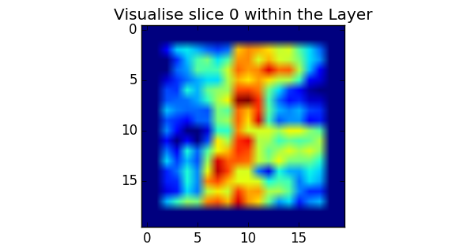
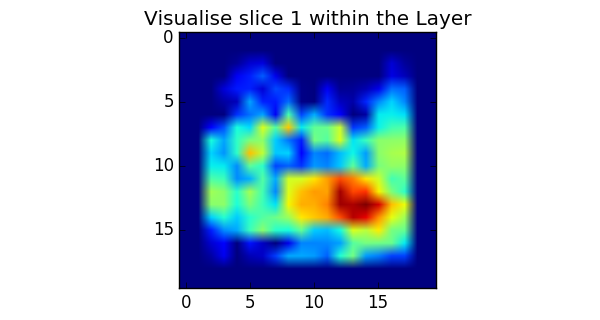
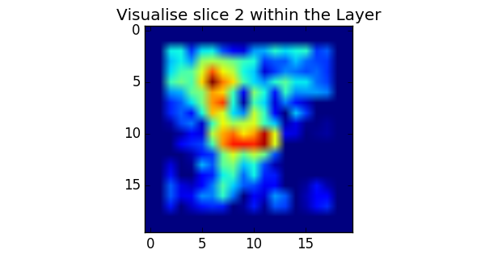
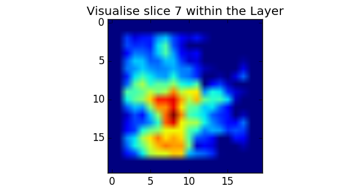
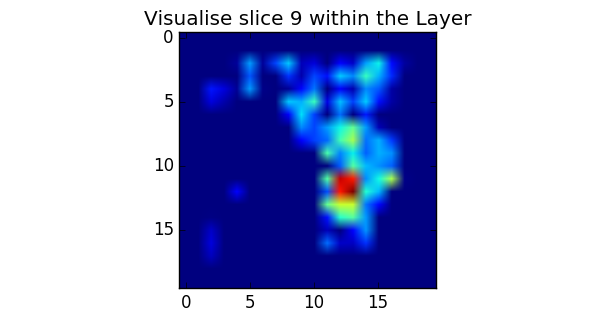

### Info

The demo script *Train.py* can used to demo the following functions:

    *   Demonstrates that the Compile Model can process an Output

    *   Demonstrates who to export the Tensorflow Model (Issue)

    *   Demonstrates how to visualise slices of the Convolutional Layers

    *   Saves model summary and Image to the Model folder

### Controllers

By changing the following lines to True will dictate the what function is processed.

    test_batch = False
    get_graph = False
    show_activation = False
    show_cmd_output = True

*   test_batch - this will compile the model, generate some random random data and then predict the output.
*   get_graph - this will when it works how to export the Tensorflow graph
*   show_activation - this function displays using Matplotlib the visulisation of 10 slices from one Covnet Layer
*   show_cmd_output - this will save a summary of the file to txt file and export the diagram of the model to a folder. Instructions are contained in the file of how to run this.

# Layer Slices

